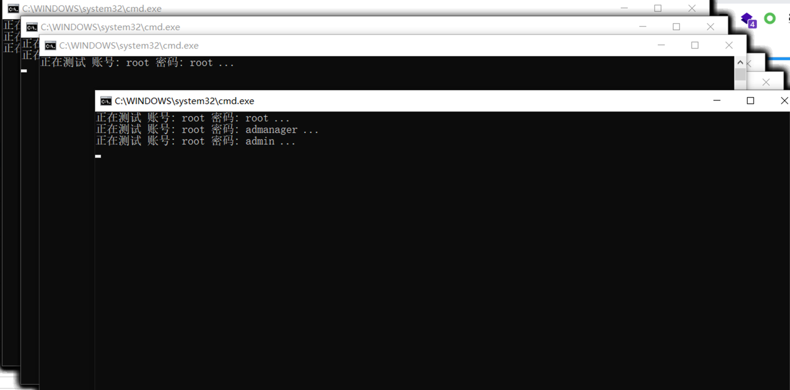
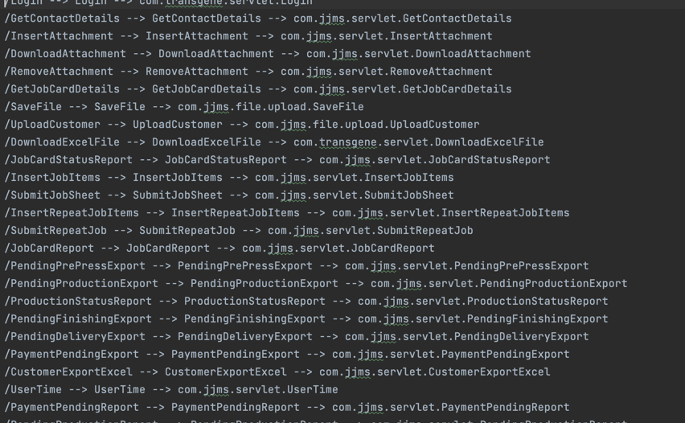
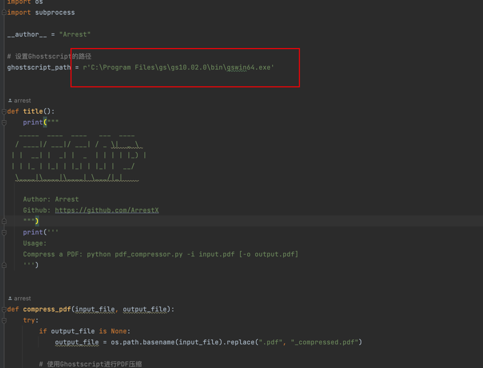
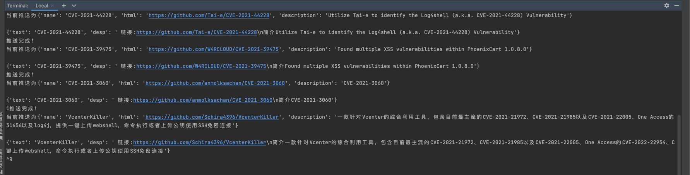
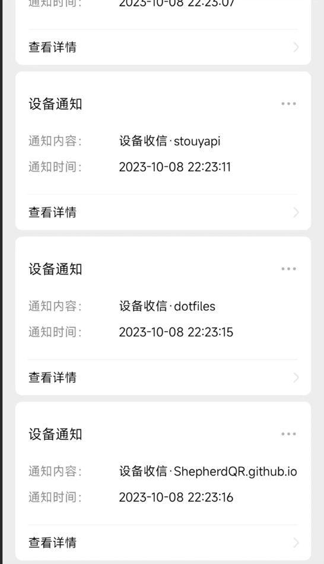
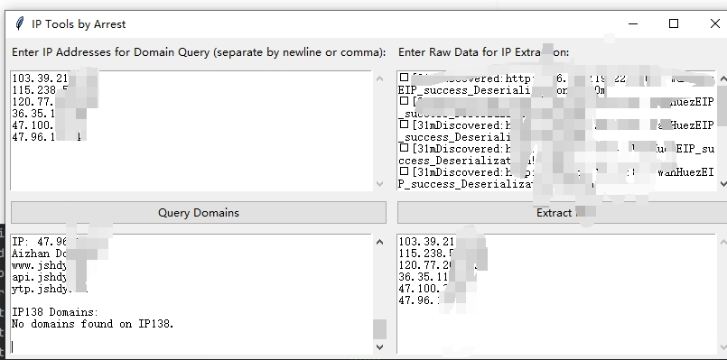

# Arrest_tools
工具大合集

1，简单的压缩炸弹脚本(目录穿越脚本)，可以对服务器造成资源损耗，py脚本，可以通过下边很清楚的看到42kb解压完有5G，用于拿到Shell进行攻击的一种方式

2.Tomcat弱口令批量验证脚本，通过开启多个bash达到的多线程

3.对一些ssm项目或者java的项目，使用web.xml文件配置相关路由的进行路由提取。

**`python3 servlet_parse.py web.xml -o 1.txt`**

4.pdf压缩工具(pdf_a_half)，对待一些大的文档，自己目测压缩率达到50%以上，当然也有在线压缩网站但是可能不安全记录数据，
适用于查重以及我们在聊天软件使用：下边的目录改为自己Ghostscript目录，百度就可下。

5.github监控一手poc信息&红蓝队信息并且推送到微信：python monitor.py -i [查询参数]

6.ip过滤&通过ip反查域名，在我们使用某些exp的工具进行poc验证完，但是我们得找到对应的公司，这个工具可以帮我们实现：

使用本软件只用于合法学习和交流，不允许非法活动，尊重他人隐私，避免发布虚假信息，尊重不同观点，不滥用功能，遵守法律，积极参与，如发现问题请报告。
 